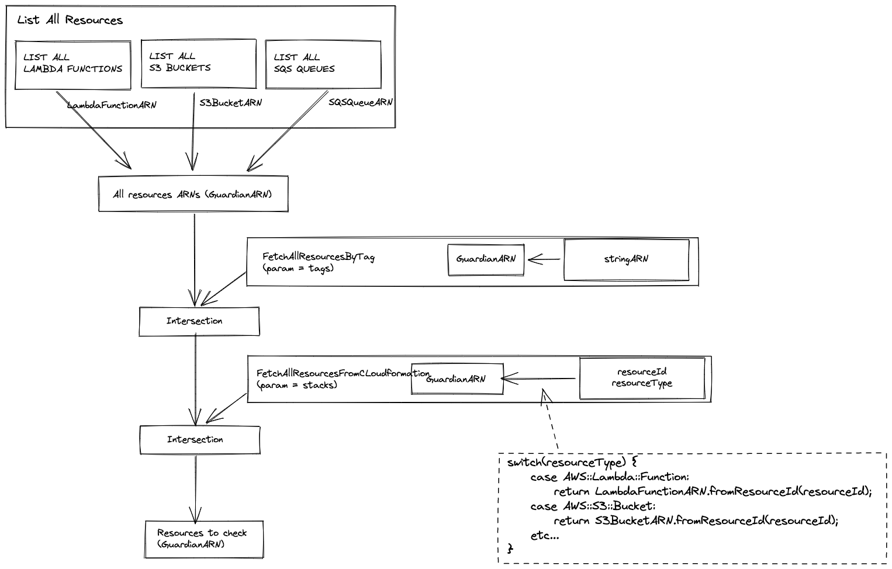
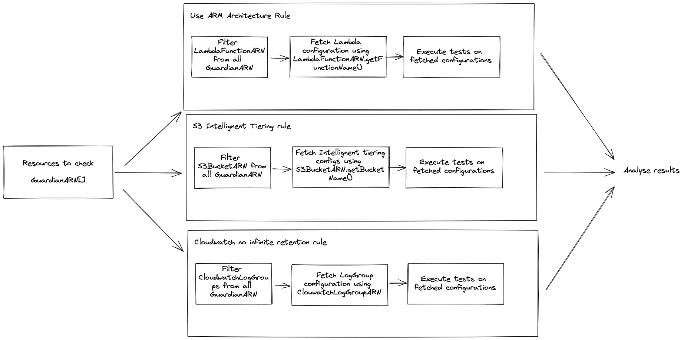

# Contributing

Guardian is an open-source project. Feel free to contribute by opening issues, suggesting improvements, or open pull-request.

## Installing the project

First clone the repository

```sh
git clone git@github.com:Kumo-by-Theodo/guardian.git
```

Install the dependencies:

```sh
npm install
```

You are ready to start developing on Guardian 🏃

## Testing your changes

If you have a default AWS profile defined in your configuration, you can launch:

```sh
npm run dev
```

This will test guardian rules against your default stack.
You can also add profile, credentials or region options to test against a different stack.

```sh
npm run dev -- -p my-profile
```

Check out documentation to learn about [CLI options](./README.md)

## Guardian's architecture

Guardian works by assessing AWS resources against a set of rules.
We first need to gather the resources to analyze, and then run a set of rules against them

### Step 1 - fetching resources to analyze

- Guardian fetches all supported resources from the users AWS account

  - Everything happens inside [`listAllResources`](./src/init/listResources/listAllResources.ts)
  - We use utils like [`listLambdaFunctions`](./src/init/listResources/lambda/listLambdaFunctions.ts) and [`listS3Buckets`](./src/init/listResources//s3/listS3Buckets.ts) to do so.
  - These listing utils return lists of ARNs with types like [`LambdaFunctionARN[]`](./src/types/arn/lambda/LambdaFunctionARN.ts) and [`S3BucketARN[]`](./src/types/arn/s3/S3BucketARN.ts)
  - Every of these types extend a base class : [`GuardianARN`](./src/types/arn/GuardianARN.ts), which implements the ARN interface from AWS sdk.

    - This class is used to help manipulate resources inside Guardian, like filtering, matching... See more in [the class definition](./src/types/arn/)

- Based on the user's input, Guardian fetches resources corresponding to tags.

  - We use the tagging client SDK inside a util [`fetchTaggedResourceArns`](./src/init/fetchTaggedResourceArns.ts)
  - We convert the list of string ARNs returned into a list [`GuardianARN[]`](./src/types/arn/GuardianARN.ts)

- Based on the user's input, Guardian fetches resources corresponding to cloudformation stacks.

  - We use the cloudformation client SDK inside a util [`fetchCloudFormationResourceArns`](./src/init/fetchCloudFormationResourceArns.ts)
  - Based on the resourceTypes and physicalIds returned by cloudformation, we generate [`LambdaFunctionARN`](./src/types/arn/lambda/LambdaFunctionARN.ts), [`S3BucketARN`](./src/types/arn/s3/S3BucketARN.ts) (using a big switch case)

- Finally, we execute a double intersection between:
  - The results of the overall listing
  - The listing by tags
  - The listing by stack
- This creates a filtered [`GuardianARN[]`](./src/types/arn/GuardianARN.ts) list of resources that will be analyzed by Guardian.

Summary of the resources fetching architecture :



### Step 2 - assessing resources against rules

- Guardian is composed of a dozen of rules. These rules are based on different AWS Services
- Each rule's input is the full list of all resources to analyze (the result of step 1). This input list is made of GuardianARN objects, that can be LambdaFunctionARN, S3BucketARN etc...
- Each rule has the ownership of fetching the configuration data necessary to perform the quality checks.

  - For example, useARMArchitecture rule fetches the list of Lambda function configurations, and then checks in each of these configurations if the use of ARM processors is enabled.
  - Rules use utils located into the [`aws-sdk-helpers`](./src/aws-sdk-helpers/) folder to fetch the necessary data. Usually, these helpers work like this :

    - Their input is a GuardianARN[] array
    - They filter from this array only the resources ARNs they need (using the GuardianARN.filterArns static method)

    ```typescript
    const lambdas = GuardianARN.filterArns(resources, LambdaFunctionARN);
    ```

    - Using the filtered list of ARNs, they fetch the configuration elements they need, and often return configurations under the format :

    ```typescript
    {
      arn: LambdaFunctionARN, // or S3BucketARN, etc...
      configuration: Configuration //any type corresponding to the configuration
    }[]
    ```

  - Finally, with all the necessary configuration data fetched, rules run checks on elements of this configuration data. Returning results under the format

  ```typescript
  Promise<{
    results: RuleCheckResult[];
  }>;
  ```

Summary of the rules running architecture :



## Adding a new rule

If you wish to contribute by sharing your learnings, you can add a new rule to Guardian.

To do so:

1. Copy one of the [rules directory](./src/rules).
2. Modify the index to implement your rule logic as well as configuration

   - Use existing [`aws-sdk-helpers`](./src/aws-sdk-helpers/) utils to fetch needed configurations if they are already available
   - Otherwise , create a new util. Knowledge of AWS sdk and GuardianARN class will be helpful. You can take example from utils like [fetchLambdaConfiguration](./src/aws-sdk-helpers/lambda/fetchLambdaConfiguration.ts)

3. Export your rule in the [rules index](./src/rules/index.ts)
4. Add you rule to [Guardian engine](./src/index.ts) in the method `runGuardianChecks`
5. Rename the rule documentation
6. Document your rule for others to understand why it's important and how to fix it.
7. Test that your rule works as expected against your stack
8. Open a pull-request. The Guardian maintainer team will review it and publish it in the next version.

If your rule needs resources from a service that is not supported:

1. Create a new ARN class extending GuardianARN (copy [`LambdaFunctionARN`](./src/types/arn/lambda/LambdaFunctionARN.ts) for example)
2. Adapt the logic of this class to be able to be generated from a CloudFormation resourceId, and from any information returned by the sdk (example: fromFunctionName for Lambdas)
3. Add a case to the big switch case in [`fetchCloudFormationResourceArns`](./src/init/fetchCloudFormationResourceArns.ts). This will allow Guardian to turn resources from cloudformation into your new ARN class.
4. Create a `list<YourReource>.ts` file in the [`listResources`](./src/init/listResources/) folder
5. In this file, use the AWS SDK to list all the needed resources from the user's account (don't forget pagination), and then use your new ARN class methods to turn the sdk data into your new ARN class
6. Invoke this function in the [`listAllResources`](./src/init/listResources/listAllResources.ts) file
