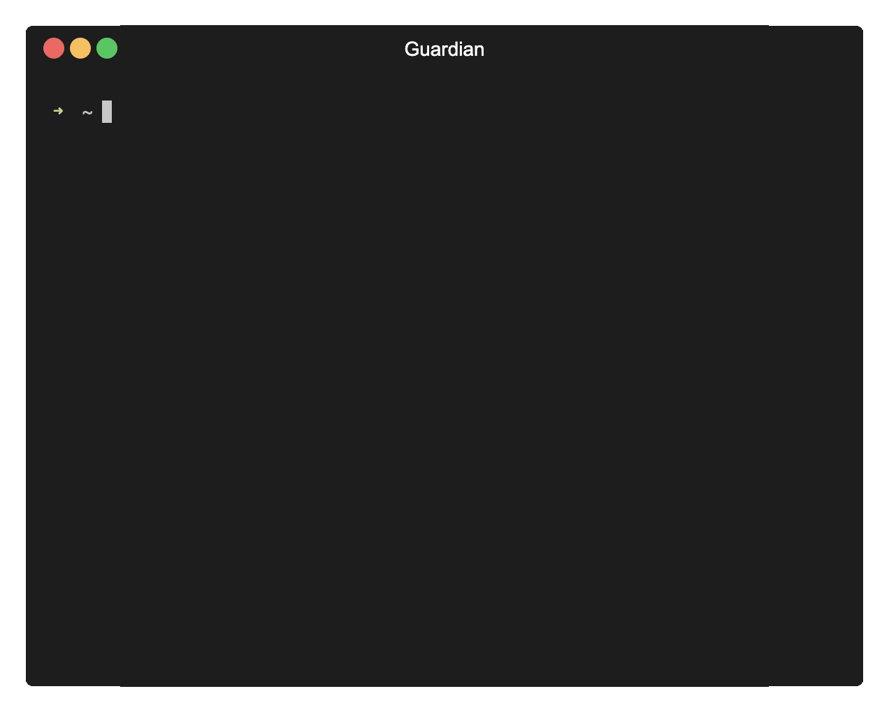

  <h1>
     
     
    
     
    
     
  </h1>
  
    
We are open to contributions, check our <a href="https://github.com/sls-mentor/sls-mentor/issues?q=is%3Aopen+is%3Aissue+label%3A%22good+first+issue%22">good first issues</a>!

    
    
  
   
   
  

    <q>Just because you don't see something, doesn't mean it doesn't exist</q>
  

   
 Anonymous on Tumblr - 2012 

    
  

    <a href="https://www.sls-mentor.dev"><b>sls-mentor</b></a> is a tool that analyzes the configuration of your AWS resources against best practice rules.  <a href="https://www.sls-mentor.dev"><b>sls-mentor</b></a> solves problems before they occur, and optimizes your app’s performances and costs.
  

  
Check our <a href="https://www.sls-mentor.dev">website</a> for more information! 

 
 

  <h2>One minute quick start 🚀</h2>
   
  <pre>npx <a href="https://www.npmjs.com/package/sls-mentor">sls-mentor</a></pre>
    
   
   

 

  <h2>Install sls-mentor on your project and customize your experience 🔎</h2>
   
  <pre>yarn add -D <a href="https://www.npmjs.com/package/sls-mentor">sls-mentor</a></pre>

  
Select the cloudformation stacks you want to check using -c option

  <pre>yarn sls-mentor -c {YOUR_AWS_STACK_NAME_1} {YOUR_AWS_STACK_NAME_2}</pre>

  
Filter the checked resources by tags using the -t option

  <pre>yarn sls-mentor -t Key={TAG_KEY},Value={TAG_VALUE}</pre>

  
Specify an AWS profile or an AWS region using -p and -r options

  <pre>yarn sls-mentor -p {YOUR_AWS_PROFILE} -c {YOUR_AWS_STACK_NAME} -r {YOUR_AWS_REGION}</pre>

  
<a href="./docs/running-locally.md">📚 More information about local runs of sls-mentor</a>

   

 

  <h2>Run sls-mentor as a periodic check on your CI 📟</h2>
   
  
The command you want to run in your pipeline is:

  <pre>yarn sls-mentor -p {YOUR_AWS_PROFILE} -c {YOUR_AWS_STACK_NAME} -r {YOUR_AWS_REGION} -l {YOUR_DESIRED_LEVEL}</pre>

  
<i>Github actions, Circle CI, Gitlab CI configuration snippets coming soon 🚀</i>

   
  
⚠️ To make sure it properly works when executed by a pipeline runner: 

- Ensure that the CI/CD runner has an AWS profile configured, with ReadOnlyAccess privileges. 
- If the region is not configured for that profile, make sure to specify it using the -r flag in the command. 

  
<a href="./docs/running-in-ci.md">📚 More information about CI runs of sls-mentor</a>

 
 
<h2 align="center">Rules featured by sls-mentor 📏</h2>
 

- AWS Lambda:
  - [`Lambda: Use ARM64 architecture`](./apps/documentation/docs/rules/useArm.md): checks that you're using ARM64 architectures for your Lambda functions.
  - [`Lambda: No shared IAM roles`](./apps/documentation/docs/rules/noSharedIamRoles.md): checks that each one of your Lambda functions has its own IAM role.
  - [`Lambda: Limited amount of versions`](./apps/documentation/docs/rules/limitedAmountOfVersions.md): checks that you do not store all previous deployment versions for your Lambda functions.
  - [`Lambda: Specify failure destination to async functions`](./apps/documentation/docs/rules/asyncSpecifyFailureDestination.md): checks that each one of your async Lambda functions has a failure destination.
  - [`Lambda: No identical code`](./apps/documentation/docs/rules/noIdenticalCode.md): checks that each one of your Lambda functions has different code.
  - [`Lambda: Light bundle`](./apps/documentation/docs/rules/lightBundle.md): checks that each one of your Lambda functions' bundles is reasonably small.
  - [`Lambda: No default memory`](./apps/documentation/docs/rules/noDefaultMemory.md): checks that you have consciously configured your Lambda functions' memory size.
  - [`Lambda: Under maximum memory`](./apps/documentation/docs/rules/underMaxMemory.md): checks that each one of your Lambda functions' memory size is reasonably small.
  - [`Lambda: No maximum timeout`](./apps/documentation/docs/rules/noMaxTimeout.md): checks that your Lambda functions' timeout is not set at the maximum available.
  - [`Lambda: No provisioned concurrency`](./apps/documentation/docs/rules/noProvisionedConcurrency.md): checks that no Lambda function has provisioned concurrency.
    concurrency.
  - [`Lambda: No deprecated runtime`](./apps/documentation//docs/rules/noDeprecatedRuntime.md): checks that your Lambda functions do not run on deprecated runtime.
- AWS S3:
  - [`S3: Use intelligent tiering`](./apps/documentation/docs/rules/useIntelligentTiering.md): checks that each one of S3 buckets has intelligent tiering enabled.
  - [`S3: Server-side encryption enabled`](./apps/documentation/docs/rules/serverSideEncryptionEnabled.md): checks that server-side encryption is enabled on each S3 bucket.
  - [`S3: Use HTTPS requests only`](./apps/documentation/docs/rules/s3OnlyAllowHTTPS.md): checks that users access buckets objects using SSL.
- AWS SQS:
  - [`SQS: Specify a DLQ on queues`](./apps/documentation/docs/rules/specifyDlqOnSqs.md): checks that SQS queues have a dead-letter-queue specified in case of failure
- AWS Cognito:
  - [`Cognito: Sign-in case insensitivity`](./apps/documentation/docs/rules/cognitoSignInCaseInsensitivity.md): checks that your Cognito user pool is insensitive to user name case.
- AWS CloudWatch:
  - [`CloudWatch Log Groups: Defined logs retention duration`](./apps/documentation/docs/rules/definedLogsRetentionDuration.md): checks that each of your Log Groups has a defined log retention duration.
- AWS EventBridge:
  - [`EventBridge: Specified dead letter queue`](./apps/documentation/docs/rules/specifyDlqOnEventBridgeRule.md): checks that each Event Bridge Rule target has a dead letter queue.
- AWS CloudFront:
  - [`CloudFront: Enable security headers`](./apps/documentation/docs/rules/cloudFrontSecurityHeaders.md): checks that each CloudFront distributions have basic security headers enabled.
- AWS RDS:
  - [`RDS: Enable instance autoscaling`](./apps/documentation/docs/rules/autoscaleRdsInstanceEnabled.md): checks that RDS instances have autoscaling enabled.
- AWS Backup:
  - [`Backup: Defined Backup Retention Period or Transition to Cold Storage`](./apps/documentation/docs/rules/definedBackupRetentionPeriodOrTransitionToColdStorage.md): checks that each rule of any Backup Plan has a defined retention period or transition to cold storage date.
- AWS API Gateway V2:
  - [`API Gateway: Use authorized routes`](./apps/documentation/docs/rules/noUnauthorizedApiGatewaysV2Routes.md): checks that each API Gateway route has an authorizer configured.

Check out our articles, to find out more:

- <a href='https://dev.to/kumo/guardian-100-available-now-your-free-open-source-audit-tool-for-aws-architectures-54cd'><b>sls-mentor 1.0.0 available now! Your Free Open Source audit tool for AWS architectures!</b></a> by <a href='https://twitter.com/eloiatheodo'>Éloi</a>
- <a href='https://dev.to/kumo/that-one-aws-lambda-hidden-configuration-that-will-make-you-a-hero-guardian-is-watching-over-you-5gi7'><b>That one AWS Lambda hidden configuration that will make you a Hero - sls-mentor is watching over you</b></a> by <a href='https://twitter.com/Gozinebgo'>Zineb</a>
- <a href='https://dev.to/kumo/aws-lambda-versions-time-to-clean-up-guardian-is-watching-over-you-jkd'><b>AWS Lambda Versions : Time to clean up! - sls-mentor is watching over you</b></a> by <a href='https://twitter.com/PierreChollet22'>Pierre</a>
- <a href='https://dev.to/kumo/aws-lambda-101-shave-that-bundle-down-48c7'><b>AWS Lambda 101: Shave That Bundle Down</b></a> by <a href='https://twitter.com/eloiatheodo'>Éloi</a>

 
 

  <h2>About sls-mentor 📰</h2>
   
  

  sls-mentor is a <a href='https://www.theodo.fr/startup-studio-m33'>Theodo Group</a> project made for AWS Serverless developers by AWS Serverless developers. Original idea appeared at <a href='https://www.aleios.com/'>Aleios</a>. sls-mentor was migrated to Typescript and enriched by <a href='https://www.theodo.com/experts/serverless'>Kumo</a>.
  

 
 

  <h2>Contributors ❤️</h2>
   
  
  
   
   
  <h4>Your contributions are very welcome, feel free to add new rules to sls-mentor !</h4>
   
   

